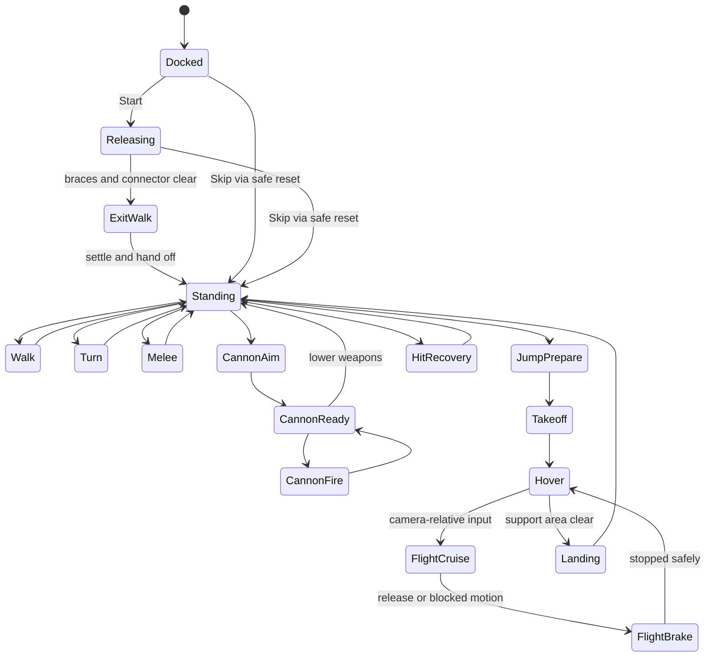

# Jaeger Demo: Coastal Proving Ground

## 1. Purpose and status

**Version:** 1.2, 2026-09-15. **Status:** aligned specification for a Kiln-authored cradle intro, interactive ground/low-flight showcase, optimized shared assets, and owner playtesting before publication. Local setup and hero qualification have begun; the complete scene remains in progress. Qualification evidence does not establish scene acceptance.

Build one polished browser scene that demonstrates a complete Kiln-authored mechanical character in motion, with a Kiln-built maintenance cradle and coastal environment, collision, visual effects, and generated sound. Visitors watch a brief cradle-release intro, take control on PC or mobile, inspect every animation, and download the character.

**Working repository name:** `jaeger-demo`.

**Display title:** Jaeger Demo.

**Subtitle:** Coastal Proving Ground.

**Description:** An interactive mech showcase built with Kiln assets.

The first release succeeds when the Jaeger feels heavy and powerful, its construction and articulation remain visible, the intro hands off seamlessly to responsive ground/low-flight controls, and the same experience is usable on PC and mobile. This is a contained demo scene with repeatable actions. There is no progression or win condition.

**Aligned scope:** all solid assets and mechanical animation are authored by Astra using Kiln, including the cradle, braces, connector, props, terrain, and new motion helpers. Destruction, loose-body simulation, and Rapier are outside v1. Use a custom collision controller with simple static proxies; add BVH only for justified mesh queries. Water, atmosphere, lighting, and VFX are the explicit Three.js/TSL exceptions. Gate 5 delivers the finished local production build for the owner's playtest. Gate 6 starts only after that playtest, requested fixes, and explicit release approval.

This file and `docs/implementation-goal.md` are the current planning sources. Copies in frozen asset delivery folders/ZIPs are historical snapshots and do not override v1.2.

### Reading this specification

- **MUST** means required for the first release.
- **SHOULD** means a proposed implementation or quality target that can change when measurements or visual review justify it. Record the change.
- **LATER** means outside the first release.
- Numerical performance budgets below are proposed targets, not measurements or guarantees.
- Existing asset checks establish the input asset's condition. They do not establish that the future scene, controls, rendering, collision, or IK work.

## 2. Scope and authorship

### First-release requirements

| ID | Requirement |
| --- | --- |
| SCOPE-01 | One coastal industrial proving ground with a single continuous play area and a 79.25 m Jaeger against human-scale reference objects. |
| SCOPE-02 | The complete textured v4 Jaeger, all 16 original native animation clips and rig/socket hierarchy, plus the Kiln-authored helper clips needed for activation and responsive controls. |
| SCOPE-03 | A skippable approximately 12-second cradle intro, seamless handoff to control, Replay Intro, and an expandable animation inspector. |
| SCOPE-04 | Ground, obstacle, turn, camera, and low-flight collision through a custom controller; static scenery and bounded movement. |
| SCOPE-05 | Repeatable blade and cannon demonstrations against intact training targets, plus tap-to-hop and steerable low boost flight with safe landing. |
| SCOPE-06 | Socket-aligned weapon/flight effects, landing dust, generated sound, and carefully framed cameras. |
| SCOPE-07 | PC and touch controls, quality settings, pause, mute, reset, and downloads. |
| SCOPE-08 | A static browser application that runs without Kiln or an audio-generation service at runtime. |
| SCOPE-09 | Performance is part of first-release acceptance: optimize the runtime assets, validate cold actions and frame pacing, and publish only claims supported by recorded device/backend tests. |

### What is generated where

| Content | Authoring requirement |
| --- | --- |
| Jaeger, armor, rig, animation keyframes, sockets | Kiln; preserve the existing editable sources and native exports. |
| Dock, hangar, maintenance cradle/gantry, support arms, locking braces, rear service connector, truck, equipment, targets, barriers, rocks, terrain | Kiln-authored geometry exported to GLB. |
| Cradle mechanical pivots/release tracks and Jaeger activation/flight/transition helper clips | Kiln-authored native animation exported to GLB; runtime plays and coordinates these tracks. |
| Solid-asset base materials and texture maps | Kiln materials and deterministic procedural maps by default. |
| Water surface, sky, fog, lighting, particle carriers, trails, screen effects | Three.js/TSL runtime rendering. Simple effect geometry is an explicit exception to the Kiln solid-asset rule. |
| Collision proxies, hit volumes, camera paths, placement/configuration | Runtime/configuration data; these are not presented as authored visible assets. |
| Sound effects and ambience | ElevenLabs-generated files, auditioned and edited before inclusion. |
| Interface | HTML/CSS/TypeScript. |

**AUTHOR-01:** Every shipped solid asset MUST have Kiln source provenance. Reuse and instance a small coherent asset kit. Do not substitute downloaded scenery or hand-modeled Blender geometry.

**AUTHOR-04:** Astra authors and reviews the actual demo assets through the asset workspace's Kiln workflow. The Muse/OpenCode contributor dogfood asset remains a disposable engine/export test and MUST NOT be included. Runtime code may place, instance, batch, and play exported assets; it MUST NOT substitute ad hoc Three.js solid modeling or runtime-authored mechanical joint curves for the required Kiln outputs. Author any new activation, cradle-release, flight, or ground-contact helper tracks in Kiln. Camera paths, control/root transforms, collision response, contact correction, material modulation, and effect timing remain runtime responsibilities.

**AUTHOR-02:** Runtime material enhancements MUST preserve the downloadable Jaeger's portable PBR appearance. Keep the canonical download separate from scene-only effects and optional runtime optimizations.

**AUTHOR-03:** The public explanation MUST distinguish Kiln asset authoring, Three.js rendering/custom control, and ElevenLabs sound. Do not claim Kiln performs runtime collision or that the scene's TSL effects are embedded in the character GLB.

### Later additions

A creature or second hero rig; enemy AI; missions, health, scoring, inventory, or multiplayer; all destruction/fracture and loose-body physics; arbitrary voxel destruction or structural collapse; unrestricted altitude/six-axis flight; ragdolls; terrain walking/climbing; a weather/day-night simulation; music generation; a browser asset editor. Rapier is not a v1 dependency.

These items do not block the first release. A Kiln-authored armored crustacean is a plausible later character, with its own explicit modeling and animation pass.

## 3. Verified starting asset

Source workspace: [kiln-mech](C:/Users/Mattm/X/kiln-mech).

| Item | Current value |
| --- | --- |
| Canonical GLB | [jaeger-complete-v4.glb](C:/Users/Mattm/X/kiln-mech/output/jaeger-complete-v4.glb) |
| SHA-256 | `14155efa3ebef47839b70632c0b185557d743abcb99d00e2fa093ba75e3553e0` |
| Portable source package | [jaeger-complete-v4.zip](C:/Users/Mattm/X/kiln-mech/output/jaeger-complete-v4.zip) |
| Size | 3,771,340 bytes |
| Geometry | 71,620 triangles; 470 meshes; 564 nodes; 93 named joints |
| Materials | 14 materials; eight embedded PNG maps: four 256 x 256, one 512 x 512, three 64 x 64 |
| Motion | 16 clips; 359 tracks |
| Source scale and axes | Approximately 8.12 m tall; metres; +X forward, +Y up, +Z right |
| Demo scale | Target 79.25 m tall (260 ft benchmark); one documented uniform scene scale, approximately 9.76x; ordinary environment objects retain real-world dimensions |
| Native ground/combat source | `p_83b045764971` |
| Native boost/weapons source | `p_c50bf8dd6b42` |
| Motion contract | [motion-design.md](C:/Users/Mattm/X/kiln-mech/motion-design.md) |
| Asset verification | [v4 verification](C:/Users/Mattm/X/kiln-mech/output/jaeger-complete-v4.glb.verification.json), 226 checks passed |
| Metadata-trimmed runtime candidate | [jaeger-complete-v4-runtime.glb](C:/Users/Mattm/X/kiln-mech/output/jaeger-complete-v4-runtime.glb), 2,102,188 bytes; SHA-256 `0cdb3f0a0f7ce13824e19ecd44f23d0f2d7720c4906505ba68341853170f319f` |
| Runtime metadata | [sidecar](C:/Users/Mattm/X/kiln-mech/output/jaeger-complete-v4-runtime.kiln-metadata.json), 1,669,629 bytes; filename/hash verified against GLB pointer |

**ASSET-01:** Use v4. The old viewer revision `a_87fe5d7d4f59475fabc8a6fe102fb941 / r_b3c6aa9f69a343ff92ebe02582be0a63` is v2 and MUST NOT become the scene input accidentally.

**ASSET-02:** Preserve the slate-gray armor, yellow visor, cyan accents, white `2-03`, corrected thumbs, and repaired rear/thigh/shin/upper-arm surfaces. Review these areas again in the actual demo renderer.

**ASSET-03:** Copy required source and build records into the future repository. The deliverable MUST not depend on an absolute path to this workstation. Existing absolute links here identify the inputs for the initial handoff.

The installed authoring runtime was verified as Kiln 0.7.1 at `2ddabd656717ac29fffb4d947f6ed4b3001f664f`. Recheck the installed runtime before generating the new environment; record the version actually used. Preserve the current Jaeger's existing provenance if the environment uses a newer engine.

**ASSET-04:** Before new authoring, refresh/check the latest Kiln main and the actual workspace installation, then record the resolved commit/version. Main was verified at `764d0e320fa323c2717df5cf34ce182a9ba56d89` on 2026-09-15 after PRs #115 and #116 merged. This does not establish that the asset workspace installation has been updated. Use its setup/authoring skills and verify the active runtime before generation; keep engine implementation work separate.

### Is the asset ready?

**Ready for integration; runtime performance remains to be established.** V4 replaces the identification, tiny paint chips, and eleven bolt sockets with Kiln-authored textures, removing 3,220 triangles and thirteen mesh objects. Remaining geometry and normals, all retained node transforms/parents, all 359 animation tracks, and the original four texture maps match v3. The entire v4 rebuild is now byte-reproducible across output folders. See [texture optimization](texture-optimization.md).

The remaining 470 mesh submissions are the first optimization priority. Do not delay all scene work waiting for an abstract "optimal asset," and do not build the full presentation on an unmeasured hero. Gate 0 below qualifies a runtime derivative in a minimal renderer first. The canonical v4 GLB and editable sources remain the fidelity reference.

The [Kiln export-profile PR #116](https://github.com/matthew-kissinger/kiln/pull/116) merged to main on 2026-09-15 at `764d0e320fa323c2717df5cf34ce182a9ba56d89`, after #115. The runtime file above was generated during candidate qualification; all 226 existing export/material/motion checks pass on that exact GLB, including all sixteen clips over 1,335 sampled frames. See [runtime export proof](C:/Users/Mattm/X/kiln-mech/output/jaeger-complete-v4-runtime.export.json). This is metadata/export proof, not Gate 0 rendering/batching qualification. The pair is slightly larger overall; applications load only the smaller GLB and keep the sidecar outside the loading path. Use the merged export-profile documentation and record the actual installed commit. Default editable output and opt-in runtime delivery are distinct from the separate opt-in experimental glTF converter; the demo does not require switching converters.

## 4. Scene composition and terrain

### Art direction

A working industrial dock set into a rocky coast. Warm, low-angle sunlight catches the armor; cooler sky illumination separates its shaded surfaces. Concrete is darker and less reflective than the Jaeger. Orange hazard details and cyan weapon effects provide restrained accent colors.

**ART-01:** The Jaeger MUST read as a massive 79.25 m machine. Keep the parked service truck around 4-6 m long, doors around 2 m high, railings around 1 m high, and stairs/catwalk details at human scale. The cradle/hangar are purpose-built monumental structures, not enlarged ordinary props. Use a few clear reference objects in the same shot rather than adding a city or crowd.

### Lore scale reference, checked 2026-09-15

Jaegers have model-specific dimensions. Prime 1 Studio's licensed Gipsy Danger description gives the fictional machine a height of **260 feet**, equivalent to **79.248 metres**. Set the custom demo Jaeger's target to **79.25 m**, rounded to centimetres, using that sourced benchmark rather than the earlier unsourced 80 m estimate. [Prime 1 Studio: Gipsy Danger](https://www.prime1studio.com/pacrim-gipsy-danger/UDMPACRIM-01.html)

For comparison, the Pacific Rim Wiki lists Striker Eureka at **250 feet / 76.2 m**, citing the film art book. That is a secondary reference; the original book was not inspected for this spec. The custom shoulder-cannon design uses Gipsy's sourced height benchmark without claiming to reproduce that named character. The demo's steerable boost controls are a design requirement, not a claim that every lore Jaeger has this flight capability. [Striker Eureka reference](https://pacificrim.fandom.com/wiki/Striker_Eureka_%28Jaeger%29)

**SCALE-01:** Preserve v4's original approximately 8.12 m authoring scale and immutable downloads. Define one `mechScale = targetHeight / measuredNeutralHeight` from the actual GLB bounds, targeting 79.25 m, and apply it once at a scene wrapper. Measure the neutral standing model from sole to highest attached feature and document that convention; posed/banked extents may differ. Runtime world space uses metres. Scale collision dimensions, extracted root distances, support offsets, IK segment lengths/tolerances, socket effects, movement/braking distances and flight envelopes consistently. Do not scale environment reference objects by this factor or multiply already-world-transformed sockets twice.

**SCALE-02:** Native Walk's 3.2 m displacement becomes approximately 31.2 m per cycle in the scene; Takeoff's 2 m root lift becomes approximately 19.5 m; native ForwardFlight's 4 m becomes approximately 39.0 m. These are scale conversions, not newly authored clip values. Preserve native inspection at original playback rates; tune Pilot speed/retiming and camera motion for visible weight, with event timings following clip time. Record final measured height, scale, travel speed and flight limits. Validate scale before the cradle/terrain pass.

**SCALE-03:** Use low human-height intro views with a truck/rail/door reference in frame, visible service catwalks on the cradle, atmospheric separation, long readable strides and restrained camera acceleration. Wider flight views retain the dock/coast as size references. Tune camera near/far planes, fog and fitted shadow volumes for the enlarged scene; avoid z-fighting or oversized shadow allocation. Numeric scale alone is not artistic acceptance.

**Scale acceptance evidence:** Record the measured neutral source bounds, the single wrapper scale and the resulting world height (79.25 m, within 0.05 m). Include a low intro view and a normal gameplay view with the Jaeger and at least one measured human-scale prop visible together. The sole-to-highest-attached-feature convention is our reproducible demo convention, not a claim about how the licensed lore height was measured. The 90-110 m cradle and 480 m x 360 m deck are scene design dimensions, not sourced lore facts.

**ART-02:** Provide three strong views: the arrival/hero view, a full-body action view, and a wider flight/landing view. Keep the silhouette readable against both the hangar and the coast.

**ART-03:** Environment detail MUST support the character. Avoid dense background machinery, excessive decals, heavy fog over the subject, or effects that hide the animation.

### Spatial plan

Initial layout target: a roughly **480 m x 360 m** concrete deck, with an inset operating area and a clear action corridor initially around 80 m wide. A roughly 90-110 m service cradle frames the 79.25 m Jaeger; tune its actual height/clearances against the exported bounds. These are blockout dimensions, not fixed construction requirements. Build a compact visual composition with a small repeated kit; the enlarged world extent does not require more geometric detail everywhere.

- Rear edge: hangar facade and animated maintenance cradle, with a straight, unobstructed exit into the deck.
- Arrival area: docked Jaeger, parked truck, and static equipment outside the release/exit envelope.
- Central corridor: clear movement and melee demonstration space; one intact training target positioned for blade reach.
- Downrange: one or two instances of the same target family at actual cannon height, with an empty backdrop behind shots.
- Separate marked clear area: takeoff, low flight, and landing.
- Seaward edge: raised curb/seawall, visible boundary lights, then rocks and water below deck level.
- Landward edge: a low rocky bluff enclosing the composition.

The intro route is the short walk out of the cradle. Position the subsequent free-control targets to suit the actual blade/cannon range. Keep the retracted cradle outside the operating lane and the platform flush with the deck so the intro needs no step-down or climbing motion.

### Terrain requirements

| ID | Requirement |
| --- | --- |
| TERRAIN-01 | The combat/walking deck is genuinely level at the chosen world ground height. Surface texture detail must not displace the walking surface. |
| TERRAIN-02 | The surroundings use actual uneven Kiln-authored terrain geometry: rocky slopes, shoreline shelves, and a low bluff. They are not just a flat plane with a noisy color map. |
| TERRAIN-03 | Terrain generation uses a saved seed, low-frequency height variation, controlled ridges/erosion-like shaping, and restrained finer detail. Mask the deck footprint and stitch or conceal terrain edges. |
| TERRAIN-04 | Terrain noise is generated during Kiln authoring and exported. The scene does not regenerate solid terrain outside Kiln at load time. |
| TERRAIN-05 | Uneven terrain is scenic and outside the first-release movement envelope. Boundaries are visibly communicated; neither walking nor flight can cross onto it. |
| TERRAIN-06 | Terrain silhouette, slopes, normals, and visible seams are reviewed from the full camera orbit and flight view. Noise alone is not an acceptable finished landscape. |
| TERRAIN-07 | Water stays below the deck and meets the coast coherently. A shoreline foam band may hide the visual seam; no buoyancy or swimming system is required. |

## 5. Kiln asset inventory

Counts are initial scene instances, not commitments to unique models. Every family needs a material-faithful review before final placement.

| Family | Initial quantity | Visible requirements | Collision/motion |
| --- | ---: | --- | --- |
| Jaeger v4 + helper motion | 1 | Existing approved construction and finish | Custom animation-led controller; separate weapon queries |
| Concrete deck module | Repeated kit | Beveled edges, expansion joints, subtle roughness | Combined simple static deck collider |
| Seawall/curb module | Repeated kit | Coherent thickness and boundary markings | Static, unbreakable |
| Hangar facade | 1 | Large mech entrance plus human-scale service door | Static facade; no playable interior |
| Maintenance cradle/gantry | 1 assembly | Two side support arms/braces, rear service connector, structural frame, service lights, compact access details | Kiln-authored release tracks; closed/retracted proxy states; flush deck and verified cannon/armor/exit clearance |
| Maintenance truck | 1 | Believable scale and readable silhouette | Parked static obstacle; not driveable |
| Equipment crate | 3-5 | One family with shared finish | Static dressing/obstacles outside exit and landing areas |
| Training target family | 2-3 instances | Readable faces; height variants for blade and cannon contact | Static intact targets; material pulse, sparks and sound on a confirmed hit |
| Shore terrain sections | 1 coherent set | Uneven coast, low bluff, deck integration | Static coarse proxy or excluded scenic area |
| Rock cluster variants | 3-5 reused | Deliberate silhouettes, shared materials | Static scenery |
| Boundary fixtures | Reused | Bollards, warning markers, modest lamps | Merge/instance; simple boundary collider |

**ENV-01:** Asset families use consistent origins, metre units, placement conventions, and reusable pivots. Cradle manifests define docked/retracted transforms, animation events, contact points, exit bounds, and proxy states. Rigid telescoping service connections keep motion bounded and authored; no cable simulation is required.

**ENV-02:** Environment materials SHOULD reuse a small shared palette: concrete, painted steel, exposed steel, rubber, rock, and emissive markers. Use Kiln procedural texture maps; external texture packs are unnecessary for the baseline.

**ENV-04:** Maintain shared material/texture IDs across the Kiln asset kit and deduplicate equivalent resources when loading separate GLBs. Match texture content, color space, samplers, UV transforms/channels and material settings before sharing. Preserve independent mutable state for target flashes, visor startup and other per-instance effects. Shared materials alone do not reduce draw calls: instance repeated geometry/materials and batch compatible static meshes. Keep cradle/Jaeger motion boundaries independent. [InstancedMesh](https://threejs.org/docs/pages/InstancedMesh.html), [BatchedMesh](https://threejs.org/docs/pages/BatchedMesh.html)

**ENV-03:** Collision proxies, placement, source references, material categories, shared resource IDs, cradle motion/events, and target hit volumes MUST be machine-readable rather than inferred from arbitrary mesh names at runtime.

## 6. Visitor experience and interface

### Startup

**UX-01:** Show the title, a lightweight docked-hero poster, concise loading progress, and **Start**, **Skip Intro / Take Control**, and **Download GLB**. Start runs the intro and hands off to play automatically. Loading must not leave a blank canvas.

**UX-02:** A Start/Take Control gesture unlocks audio. Provide a persistent mute control and respect a saved mute preference. A soundless visitor can use every visual/interactive feature.

**UX-03:** Essential shaders, GLBs, collision data, and action sounds MUST be ready before Start/Take Control. If loading fails, present Retry and keep a working download link where possible.

### Cradle-release intro

**DEMO-01:** An approximately 12-second sequence introduces the powered-down/docked Jaeger, releases its service connections, and walks it onto the deck. It uses the same action/event and root-motion system as pilot mode. The longer 35-45 second automatic weapons/flight showcase is optional and does not block v1.

| Approximate time | Beat | Purpose |
| --- | --- | --- |
| 0-3 s | Low view past a human-scale truck/rail toward the docked Jaeger; visor/service lights illuminate | Massive silhouette, armor and scale |
| 3-6 s | Side braces unlock and retract; rear service connector withdraws; short pressure release | Kiln-authored moving machinery and coordinated sound/steam |
| 6-10 s | Jaeger activates, transfers weight and walks out along the cleared deck | Ground contact, articulation, coastal reveal |
| 10-12 s | Settle to Idle; camera eases into play view; controls appear | Seamless playable handoff |

The timeline is a shot plan. Final timestamps MUST be derived from actual clip durations, accepted retiming, and route lengths; do not speed up individual events merely to hit a timestamp.

**DEMO-02:** Author the cradle release and any required Jaeger activation/settling helper clips in Kiln. These are new assets/tracks to build; the existing sixteen clips do not already contain startup. Both feet stay on the level deck while docked. All braces/connectors clear before locomotion, with verified clearance for the shoulder cannons, armor and first full step.

**DEMO-03:** Normal completion transfers the exact accumulated world transform and camera pose to Pilot mode, with both feet planted and no pop, root reset, duplicate event, or stale input. The retracted cradle remains visible with appropriate collision. Skip Intro at any phase uses a short fade to the same fully released, safe standing state, suppressing skipped sounds/effects and clearing queued input; it must never fast-forward events audibly.

**DEMO-04:** Replay Intro is a separate explicit action that resets to Docked under a brief fade. Ordinary Reset returns directly to the post-intro playable state. Replaying does not re-fetch assets or rebuild geometry/materials. Pause/blur, skip, mute, and resize must work throughout the intro. Reduced motion uses a restrained fixed/wide camera while keeping the sequence skippable. A longer optional showcase must also hand off from a supported standing state.

### Take Control and inspection

**UX-04:** Keep primary controls to movement/turn/brake, Slash, Cannon, Hop/Boost/Land, camera, and Reset. Show context-sensitive ground/air control hints. Put individual clips, Replay Intro and secondary options in a drawer.

**UX-05:** The animation inspector lists all 16 exact original clip names and the added helper clips separately, with Play/Pause, scrub, replay, playback speed, and reset view. It uses a reserved clear inspection position, not the last arbitrary location among props. Cradle release can be replayed through Replay Intro.

**UX-06:** Scrubbing emits no target feedback or repeated audio events. Entering inspection pauses scene actions; leaving it restores the supported post-intro standing state. Offer an optional joints/sockets overlay for viewing the rig; joint editing is outside scope.

**UX-07:** Include a small About/Credits panel explaining asset generation and runtime technologies, plus GLB and source-package downloads. Backend diagnostics and detailed statistics belong in a collapsed debug panel.

## 7. Controls and movement contract

The first release uses a **third-person, camera-relative movement controller**. The existing asset has a forward walk and fixed quarter-turn clips; these do not by themselves provide responsive arbitrary steering, strafing, or continuous flight. Preserve those original clips and author the additional Kiln motion helpers required below. Runtime input, animation, collision and optional contact IK must agree on the accepted motion.

| Intent | PC default | Mobile |
| --- | --- | --- |
| Ground movement | WASD / arrows, relative to camera heading | Left virtual joystick |
| Air movement | W/S along camera look direction; A/D along camera right | Left joystick, same camera-relative mapping |
| Stop / brake | Release movement keys; dedicated Brake control in air | Release joystick; Brake control in air |
| Slash | Q; alternate left/right | Slash button |
| Combo / overhead | Animation/action drawer | Same drawer |
| Cannon burst | E | Cannon button |
| Hop / sustained flight | Tap Space for hop-and-land; hold Space to sustain flight; release requests landing | Hop button; Boost/Land toggle for sustained flight |
| Camera | Drag to look/orbit; wheel zoom | Right-side swipe outside buttons; pinch zoom |
| Pause/help | Escape / visible menu | Visible menu |
| Reset | Visible button; R when canvas has focus | Visible button |

**INPUT-01:** Ground movement projects the camera's forward/right basis onto the deck, normalizes diagonal input, and turns the Jaeger smoothly toward the requested travel direction. W advances in the viewed horizontal direction; looking upward does not raise it off the deck. A/D/S request camera-relative left/right/back travel with the body turning to face that travel, allowing forward stepping rather than assuming missing strafe/backwalk clips. Handle a nearly vertical camera with a stable last-valid yaw. The camera may look around at rest; movement/aim requests bring the mech into alignment.

**INPUT-02:** Pilot steering accepts arbitrary headings, not queued 90-degree turns. Use bounded heading acceleration/rate, step-aware steering, and Kiln-authored turn/start/stop helpers. Large heading changes may plant/turn before advancing; input feedback must remain immediate and the change must feel deliberate rather than unresponsive. Keep native TurnLeft/TurnRight intact for inspection. Validate 45/90/180-degree input changes and continuous camera rotation while moving; do not simply rotate planted feet around the root.

**INPUT-03:** Ground motion MUST start and stop through validated supported poses. Prefer contact-aware stopping at a both-feet-supported phase. Double support can leave staggered feet; a transition must preserve their world contacts and settle into a valid standing stance. An unexplained full-cycle delay or freezing mid-step is not acceptable. Target movement-release-to-stable-stop within 0.8 seconds in free space, measured throughout the cycle. Author Kiln transitions where existing clips cannot meet this cleanly. Preserve the original 16 clips.

**INPUT-04:** Input feedback appears within 100 ms on tested devices, even when an action is recovering. Maintain only the latest movement intention and at most one queued action. Reset/Pause takes precedence. Clear held input on blur, pointer cancellation, orientation change, or hidden tab.

**INPUT-05:** Flight uses the camera's three-dimensional look direction: W/joystick-forward with the camera pitched up commands a climb while advancing; looking down commands a descent. Camera right supplies lateral input. Rotate/bank the body smoothly toward accepted motion using the flight helpers; do not snap the view when the mech turns. Normalize diagonal input and honor the flight volume/clearance checks. Camera movement alone changes the desired direction, not the position of a stationary hover.

**INPUT-06:** Mobile supports separate simultaneous pointers for movement, camera, and actions. Use at least 48 CSS-pixel targets, safe-area spacing, and portrait/landscape layouts. No essential hover interactions or pointer-lock requirement. Apply touch restrictions to the interactive canvas/control area without disabling ordinary document accessibility globally.

**INPUT-07:** Movement and attack commands never accumulate indefinitely. Repeated presses during critical landing or recovery produce clear busy/queued feedback, not state corruption.

**INPUT-08:** Space initiates one takeoff; ignore key-repeat. Releasing before takeoff completes requests landing at the first safe airborne state, producing a short hop. Holding maintains flight without accumulating height. On release, brake then land if supported; if blocked, remain hovering with a clear indicator and allow steering to a valid area. Re-pressing can cancel a pending landing before descent starts. During descent, finish the validated landing transition. Mobile's Boost toggle holds the same flight intention until Land is tapped; Hop requests the same short sequence. Cancel/blur/pause clears held PC intentions safely without silently advancing landing while paused. Space handling must not scroll the page while controlling the scene.

## 8. Animation integration

### Required native clips

| Clip | Native duration | End state / event |
| --- | ---: | --- |
| Idle | 4.00 s | Standing loop |
| Walk | 2.80 s | Standing, translated +3.2 m forward |
| TurnLeft | 4.00 s | Standing, rotated +90 degrees Y |
| TurnRight | 4.00 s | Standing, rotated -90 degrees Y |
| SlashLeft | 2.50 s | Standing; strike at 1.00 s |
| SlashRight | 2.50 s | Standing; strike at 1.00 s |
| SlashCombo | 3.70 s | Standing; strikes at 1.00 and 2.20 s |
| OverheadStrike | 3.20 s | Standing; strike at 1.52 s |
| CannonAim | 1.20 s | CannonReady |
| CannonFire | 1.80 s | CannonReady; shots at 0.40 and 0.67 s |
| JumpPrepare | 1.10 s | LaunchCrouch |
| Takeoff | 1.35 s | Hover; leaves support after 0.24 s |
| Hover | 3.20 s | Hover loop; approximately 2 m root lift |
| ForwardFlight | 3.40 s | Hover, translated +4.0 m forward |
| Landing | 2.00 s | Standing; ground contact at 0.68 s |
| HitRecovery | 2.20 s | Standing; exposed through Test Impact/inspector |

### Root motion and transitions

**ANIM-01:** `Joint_MotionRoot` has one owner. Extract desired root translation/rotation from animation, resolve motion against world constraints, and commit the accepted world transform exactly once. Remove or compensate the extracted local root motion so it is not applied a second time by the visual hierarchy.

**ANIM-02:** Align incoming clip starts to the current world transform. Accumulate horizontal motion and heading across cycles. Treat hover height as an absolute pose offset relative to support, not an increment per loop. Landing consumes the takeoff offset once.

**ANIM-03:** Collision rejection and visual animation MUST agree. If a wall blocks a step, transition to a stable pose instead of translating armor through the wall or continuing an endless walk-in-place. Test translation and rotational clearance before starting tightly constrained actions.

**ANIM-04:** Default compatible cross-fades are approximately 0.12-0.25 s. Different foot-support states require contact-aware correction or Kiln-authored transitions. A generic blend alone is not proof of planted feet.

**ANIM-05:** Cinematic and pilot modes use the same state machine. Supported paths are:



**ANIM-06:** At 30/60/variable frame rates, events use crossings of animation time, not frame numbers or wall-clock timeouts. Deduplicate by action instance, loop, event, and target. Retiming must carry the event schedule with it. Suppress outgoing-action effects during irrelevant blend tails.

**ANIM-07:** Ground attacks cannot start during flight. Landing compression cannot be interrupted by an attack. A Cannon request first enters CannonReady. A second Cannon request can repeat firing; lowering weapons uses a tested exit transition.

**ANIM-08:** The inspector can play unsupported combinations in isolation, but Pilot mode cannot. HitRecovery is a controlled Test Impact action, not a requirement to add an enemy.

**ANIM-09:** Wire and review all sixteen originals in the real renderer. Native ForwardFlight remains a 3.4-second, 4 m demonstration clip; Pilot mode must not lock the visitor into that segment. Author suitable in-place cruise, steering/lean, brake and transition helpers in Kiln. Flight movement comes from one runtime controller; remove/compensate source translation when reusing moving clips. Record added clips, blend weights, contact/event schedules and allowed transitions. Include the extended animation set in the downloadable runtime character or a clearly documented companion GLB; retain the unchanged v4 canonical/source downloads.

**ANIM-10:** Review ground start/stop, arbitrary steering, blocked steps, melee, intro exit and landing before deciding whether blends alone suffice. If contact errors remain, use lightweight analytic two-bone leg IK with authored plant/swing intervals, saved world-space foot anchors, a bounded pelvis correction and a stable knee bend direction. Apply it after clip blending, using the actual exported hip/knee/ankle pivots and segment lengths. Fade IK during swing, disable foot planting airborne, limit reach and correction, and never stretch rigid armor. It corrects residual contacts; it cannot make a mismatched stride or impossible pose acceptable. If bounded corrections cannot fix the issue, refine the Kiln animation.

**ANIM-11:** Ground locomotion has one translation owner. Match accepted travel distance to the authored stride and playback rate, retarget heading within reviewed limits, and stop/settle when collision rejects motion. No second velocity may be added to an extracted root delta. IK and runtime-controlled nodes must be protected batching boundaries. Compare IK enabled/disabled for foot slip, knee flips, armor clipping, CPU cost and both renderer backends. Record runtime correction behavior separately from animation embedded in downloadable GLBs.

## 9. Custom collision and safe flight

**Selected approach:** a custom movement/collision controller over a level deck and simple static proxies. No rigid-body engine or loose-body simulation is required. Cradle machinery moves through authored transforms during the intro and stays retracted during control. Start with analytic box/capsule/plane queries. Use `three-mesh-bvh` only where irregular collision geometry or detailed ray queries justify it; record build/load/query cost. BVH accelerates queries and does not itself implement movement response. [three-mesh-bvh](https://github.com/gkjohnson/three-mesh-bvh)

| ID | Requirement |
| --- | --- |
| COLL-01 | Use a 1/60 s controller/action step with interpolated presentation and at most four catch-up substeps. Animation, root motion, collision, events, effects and timeline consume the same accepted time. Record raw stalled frame intervals before capping time. Pause/resume discards stale elapsed time. |
| COLL-02 | Use a measured body envelope plus reviewed limb/weapon clearance volumes, simple architecture/prop proxies, and the known level deck. Keep visible and collision placement/units synchronized through the asset manifests. |
| COLL-03 | Sweep requested translations and turning/attack envelopes before accepting them; endpoint overlap tests alone are insufficient. Resolve earliest contact with a small tolerance and bounded iterations. Reject or slide only where the motion can remain believable; settle blocked walking to stable support. |
| COLL-04 | Equipment and targets remain static. Model ground support, boundaries and explicit safe landing regions without adding forces, gravity on top of authored takeoff/landing, or contact impulses. |
| COLL-05 | Separate movement, weapon and camera query masks. Cradle closed/retracted states have matching proxies; its moving release phase cannot overlap the reserved Jaeger exit volume. Control starts only after all release motion finishes. |
| COLL-06 | Body/armor clearance remains active during flight, including banks and pitch. Scenic slopes/water are outside the permitted movement volume. Ground and flight cannot tunnel through thin obstacles after a stall. |
| COLL-07 | Fast weapon hits use rays or swept blade volumes. Decorative projectiles and sparks are visuals, not simulated bodies. |
| COLL-08 | Precompute/cache query data before Ready. If BVH is used, static geometry can have a built/cached tree; moving cradle proxies remain analytic or separately transformed. Keep one authoritative collision result and avoid rebuilding a detailed hero BVH every frame. |

### Flight envelope

**FLIGHT-01:** Provide steerable, bounded low boost flight relative to the massive character. Takeoff reaches the original 2 m root lift multiplied by `mechScale`, approximately 20 m in the scene. Camera-directed cruise may climb/descend within a declared root-height range, initially about 20-60 m above the deck (source-relative 2-6 m); tune and record it against full-body bounds and composition. This is root lift, not the altitude of the head. Pitch affects commanded direction, with reviewed body lean limits. Cap speed/acceleration and prevent altitude stacking. There is no unrestricted altitude, roll control, or flight outside the proving ground.

**FLIGHT-02:** Takeoff requires overhead/body clearance and a reachable clear hover/landing region. Cruise continuously sweeps desired camera-relative displacement against the static world and flight boundary; reject blocked motion and brake into a reviewed Hover pose. Releasing movement begins braking immediately, with a target stop within 0.8 s in free space and bounded stopping distance. Do not wait for a complete native ForwardFlight cycle. Ground attacks remain unavailable airborne; the original cannon/melee clips are ground-braced demonstrations.

**FLIGHT-03:** Before beginning descent, check both-foot support, controller footprint, and the entire descent path. Only the level dock's permitted landing regions qualify. Slopes, water, curbs, barriers, and large props are invalid.

**FLIGHT-04:** Reserve landing areas clear of all props. A landing request first brakes and levels the body, checks the full vertical route, then descends to the native landing-entry height multiplied by `mechScale` before playing Landing. Do not stretch the original descent over an arbitrary altitude. Author/validate the cruise-to-hover/descent helper and its transition to the original clip. Reject an invalid route and remain hovering with a blocked indicator; allow steering to a clear area. Once validated descent starts, reserve the footprint and serialize control until supported recovery finishes. Static scenery and the retracted cradle cannot move into the route; no dynamic-obstacle abort subsystem is needed.

**FLIGHT-05:** Approaching the envelope edge rejects further flight but always leaves a safe hover/landing option. Reset remains available from every state. The camera stays within a composition envelope that does not reveal unfinished scenery.

## 10. Weapons and intact target feedback

### Aiming and hits

**HIT-01:** In Pilot mode, a ground Cannon request turns the Jaeger toward the camera's projected horizontal aim heading, settles into CannonReady, then fires along the actual barrel directions. Show the actual projected hit indicator; view pitch must not promise unsupported vertical gun articulation. Aiming must not teleport or swivel planted feet. Add Kiln aim helpers if needed; do not imply the asset already has arbitrary independent turret tracking.

**HIT-02:** Use named muzzle sockets for flashes, shot origins, trajectories, and sound. Resolve the nearest valid obstruction along the shot. The trace cannot pass through a wall to activate feedback on a target selected by the camera.

**HIT-03:** Melee samples the blade's swept volume during an authored active window surrounding each strike. Windows are tuned from reviewed poses; strike timestamps alone are not a full hit volume. Each strike affects each target at most once.

**HIT-04:** Place intact target faces at the actual exported cannon/blade heights. Reuse a coherent target family with adjustable authored support heights. Do not bend shots invisibly to make staging work.

### Repeatable feedback

**TARGET-01:** Confirmed hits produce brief material-specific sparks/dust, a bounded light/material pulse on the struck target, and sound. Targets stay intact and stationary. Misses may show the outgoing weapon effect but cannot create a target-contact effect.

**TARGET-02:** Each target manifest defines its asset/proxy, hit region, material category and feedback cooldown. No damage thresholds, health, scoring, fracture states or debris lifecycle are required. Verify that shared materials do not make every target flash when one is struck.

**TARGET-03:** Repeated strikes/shots reuse effect pools. Reset clears flashes, decals, projectiles and event state; it does not rebuild or replace targets. Attack blade sweeps may enter the intended target hit region while the body stays clear of its movement proxy.

## 11. Rendering: current Three.js and TSL

### Verified version and implementation rule

The official release page identifies **r186**, released September 8, as latest at this spec's verification. Pin `three` to **0.186.0**, use matching addons, ESM, and the lockfile. Check the actual installed package before implementing any API. Review the r185-to-r186 migration notes and the matching tagged source when live documentation and examples differ. [Official r186 release](https://github.com/mrdoob/three.js/releases/tag/r186)

The stack is **Vite + TypeScript + plain Three.js + WebGPURenderer + TSL**, with a small custom controller and optional targeted BVH queries. R3F is not needed for this interface. All custom scene shaders use node materials/TSL with the current rendering pipeline. [TSL guide](https://github.com/mrdoob/three.js/wiki/Three.js-Shading-Language)

**RENDER-01:** Initialize WebGPURenderer asynchronously and provide a tested WebGL2 backend. Backend and quality tier are independent: a capable WebGL2 desktop can use higher quality; a slow WebGPU phone can use low quality. [WebGPURenderer](https://threejs.org/docs/pages/WebGPURenderer.html)

### Feature choices that improve this scene

| Feature | Application | First-release decision |
| --- | --- | --- |
| SunLight and cascaded shadows | Warm outdoor light, grounded feet, consistent shadows across dock | Preferred desktop lighting candidate; compare against one tightly fitted directional shadow for this compact scene. Mobile uses the cheaper validated setup. |
| SSAONode | Contact shading in armor gaps, under feet, and around equipment | Half-resolution desktop candidate; reduce or disable on mobile. |
| TSL bloom | Reactor, blade edges, muzzle flashes, exhaust | Restrained, thresholded bloom; armor whites and sky must retain detail. |
| TSL water | Slow waves, moving normal detail, Fresnel response, shoreline foam | Required attractive baseline; no fluid simulation. |
| TSL exhaust/trails | Animated jet structure, tapered blade trails, sparks | Required; socket-driven and pooled. |
| Environment lighting | Metal readability and warm/cool separation | Build from the procedural sky/lighting environment; no external HDR required. |
| Low-cost atmospheric fog | Coastal depth and separation of the distant bluff | Required subtle baseline. |
| OITPassNode | Reduce sorting artifacts among overlapping translucent effects | Optional only if observed artifacts justify its extra pass and memory. |
| Volumetric fog, reflective water capture, retroreflective hazard details | Extra depth and surface response | Desktop polish candidates after baseline acceptance, not simultaneous first-pass requirements. |

`SunLight` provides cascaded shadows and requires explicit node-library registration for WebGPURenderer. Configure from the r186 docs rather than assuming DirectionalLight's targeting behavior. [SunLight](https://threejs.org/docs/pages/SunLight.html)

The current `SSAONode` provides depth-aware denoising and adjustable resolution. Evaluate it at half resolution for contact shading; the visual goal is separation, not dark outlines. [SSAONode](https://threejs.org/docs/pages/SSAONode.html)

Use the current TSL bloom addon, and benchmark Dual Kawase bloom only if the pinned release exposes the required API. Existing BloomNode is a documented baseline. [BloomNode](https://threejs.org/docs/pages/BloomNode.html)

OIT has material/blending restrictions and different MSAA support between backends. It is not a universal transparency fix or a mandatory dependency for the baseline. [OITPassNode](https://threejs.org/docs/pages/OITPassNode.html)

**RENDER-02:** Water can use a custom lightweight TSL surface or adapt the official WaterMesh approach. On mobile, prefer sky/environment response and animated normals over another full scene reflection pass. [WaterMesh](https://threejs.org/docs/pages/WaterMesh.html)

**RENDER-03:** Keep custom effects compatible with both backends. Required VFX must not depend on GPU compute. Optional compute effects need an equivalent bounded non-compute path.

**RENDER-04:** Use one coherent tone-mapping/exposure/color-management setup. Avoid double tone mapping in postprocessing and preserve correct linear/sRGB treatment of the embedded PBR maps.

**RENDER-05:** Antialiasing and postprocessing must be chosen as one tested pipeline. Check thin blades, railings, stencil readability, transparent sorting, and fast camera movement. Do not add incompatible legacy passes because they appear in older examples.

**RENDER-06:** Prewarm all required action/effect material variants and render one actual shadowed frame before reporting Ready. Shader compilation alone is not evidence that first-use shadows/effects are warm.

**RENDER-07:** Failure to initialize WebGPU should allow a deliberate WebGL2 retry. If neither backend works, show a useful poster/message and download links. Device loss must stop simulation safely and offer reload/retry.

## 12. VFX and camera response

| Event | Required treatment | Limits |
| --- | --- | --- |
| Cradle activation/release | Visor/service-light sequence, subtle connector light, brief pressure-release steam | Events follow Kiln release tracks; braces remain clearly visible |
| Foot contact | Small localized dust/grit and weight impulse | One emission per contact; sparse on clean concrete |
| Slash | Tapered cyan trail following both sampled blade ends | Short lifetime; no permanent ribbons while idle |
| Melee impact | Directional sparks, material-appropriate dust, brief target pulse | Only on confirmed hit; target remains intact |
| Cannon fire | Brief flash at each muzzle, hot core, short shot streak | Fire independently at 0.40/0.67 s in clip time |
| Cannon impact | Spark/dust burst and short target pulse | At resolved hit point/normal; no fracture |
| Takeoff | Jet ignition and ground dust after support release | Exhaust tracks sockets during body pitch |
| Hover/flight | Shaped exhaust and modest shimmer/intensity change | A readable plume; heat-refraction pass optional |
| Landing | Broad dust ring, brief compression emphasis, heavy sound | On contact at 0.68 s; once per landing |
| Test Impact | Short armor spark and controlled recoil cue | Inspector/test action; no health system |

**FX-01:** Use fixed-size pools for particles, projectiles, trails, impact decals, and transient lights. No unbounded scene-object creation per frame.

**FX-02:** Cap transient unshadowed lights; muzzle light should briefly illuminate nearby armor/ground where budget allows. Avoid new shadow maps for flashes.

**FX-03:** Camera response is an additive, damped impulse layered over user/cinematic control. Never replace input with uncontrolled shaking. Include a reduced-motion setting that disables shake and aggressive cinematic movement.

**FX-04:** The follow/orbit camera checks architecture to avoid clipping into walls. Auto-frame the full mech and attack silhouette; flight widens gently. Camera collision must not cause abrupt zoom oscillation.

**CAM-01:** Use one third-person camera controller for Pilot mode, with damped follow position, independent user yaw/pitch, bounded zoom and restrained pitch limits. Input direction uses the intended camera orientation, not a collision-shortened camera-to-character vector. Avoid camera/body feedback loops when turning. The close intro eases into the exact playable view; the inspector enables free orbit without steering the character.

**CAM-02:** Validate camera-relative movement after 90/180-degree camera changes, diagonal input, near-up/down views, narrow obstacle clearance, ground-to-flight transitions and touch drag. Ground direction stays horizontal; flight direction includes camera pitch. In flight, increase framing distance modestly while keeping the horizon stable. Camera rotation while hovering must not cause translation or altitude drift.

**FX-05:** Keep the environment alive through animated water, restrained ambient steam and service/warning lights. Prefer coherent lighting, material response and event timing over extra full-screen passes. Shared textures/materials and pooled effects must still allow independent per-instance feedback.

## 13. Sound production and playback

The user authorized use of their **ElevenLabs API key** for this demo's sounds. Generate offline, review candidates, then ship selected static audio files. Do not make audio-generation requests from the visitor's browser.

The current sound-effects API supports duration control and seamless-loop requests with its v2 sound model. Resolve the exact model and output format when generating, and keep a record. [ElevenLabs sound-effects API](https://elevenlabs.io/docs/api-reference/text-to-sound-effects/convert)

### Initial sound list

| Family | Suggested variants | Direction |
| --- | ---: | --- |
| Activation / cradle release | 1 concise set | Machinery hum ramp, brace unlock, connector withdrawal and pressure hiss; synchronized with visible mechanisms |
| Heavy footstep | 3 | Hydraulic weight, metal mechanism, concrete grit; no musical impact |
| Servo movement | 2 | Low mechanical movement, restrained high-frequency detail |
| Cannon preparation | 1 | Short mechanical charge/lock |
| Cannon discharge | 2 | Powerful low-mid punch with a controlled tail |
| Blade sweep | 2 | Fast air movement with subtle energized edge |
| Metal/concrete impact | 1-2 each | Material-specific contact without collapse or breaking sound |
| Thruster ignition | 1 | Mechanical ignition into forceful exhaust |
| Thruster sustain | 1 loop | Stable broadband jet with no obvious repeating accent |
| Thruster shutdown | 1 | Short believable decay |
| Landing | 1-2 | Heavy impact, suspension/servo recovery, concrete grit |
| Coastal dock ambience | 1 loop | Quiet wind/water and distant industrial room tone |

Reuse recordings where they fit; this is a small cohesive library, not a large sound-design project. Start with one candidate per family, audition, then generate alternatives only where needed. Procedural synthesis is optional only for a simple cue that clearly sounds good; it is not the default for hero effects.

**AUDIO-01:** Keep generation scripts and prompt/model/duration provenance in the authoring tools. Keep credentials outside source, browser bundles, manifests, and logs. No generation calls are made while writing this spec.

**AUDIO-02:** Trim attack transients, fades, and tails; verify every loop seam. Convert to browser-supported formats and verify decoding on the target browsers. Audio assets should load once and reuse decoded buffers.

**AUDIO-03:** Event timing follows the same animation event schedule as VFX. Sustained thruster volume follows state; stop/fade it on landing, pause, reset, and scene exit.

**AUDIO-04:** Positional attenuation and mix levels make nearby impacts powerful without masking all other sounds. Use small pitch/gain variation for repeated samples, voice limits, and a limiter or conservative headroom. No clipping, sudden full-volume stacking, or unintended silence at loop joins.

**AUDIO-05:** Require listening on headphones and ordinary speakers/phone audio. File validity or loudness statistics are not substitutes for hearing the sounds. Record the applicable generation/license provenance without inventing a redistribution license.

## 14. Reset, pause, and lifecycle

**RESET-01:** One Reset restores the post-intro standing position/pose, playable camera, retracted cradle/proxies, static target state, movement/flight intentions and velocities, IK anchors, event deduplication, effect pools, projectiles and sound loops. Reset never forces the intro to replay. Replay Intro separately restores the docked baseline under a short fade.

**RESET-02:** Reset does not reload the entire page. It leaves counts at the recorded baseline. Shared loaded assets stay cached; per-instance simulation/effect state is reset.

**RESET-03:** Pause freezes animation, controller/collision updates, IK, effects and timeline consistently and pauses/fades audio. Resume does not consume wall-clock time spent paused. Downloads and UI remain usable.

**RESET-04:** Hidden tabs clear held inputs and pause. On return, show a safe paused state. Dispose instance resources and listeners when recreating renderer/world; avoid duplicate loops and input handlers.

## 15. Performance, quality tiers, and accessibility

These are initial engineering targets and become release gates on the named reference devices. Select and record the available PC, a midrange Android phone, and an iPhone before the main environment pass. A desktop resize or mobile emulation is not evidence of real-phone performance. Device coverage that cannot be exercised stays explicitly untested; do not generalize a fast workstation result to all phones.

| Budget | Desktop target | Mobile target |
| --- | --- | --- |
| Smooth action playback | >=58 fps average at 1080p; p95 frame interval <=20 ms, p99 <=25 ms | >=29 fps average; p95 <=40 ms, p99 <=50 ms on recorded Android/iPhone |
| Cold action after Ready | No action-triggered frame >50 ms | No action-triggered frame >50 ms |
| Sustained frame pacing | Investigate every >50 ms foreground hitch; no recurring action/reset hitch | Investigate every >50 ms foreground hitch; no recurring action/reset hitch |
| Drawing-buffer pixel ratio | Cap 1.5 initially | Cap 1.25; adaptive down to 0.75 |
| Primary visible geometry | <=200k triangles typical | <=200k, reduce scenery where necessary |
| Main scene color draw submissions | <=220 target after runtime optimization | <=220 target after runtime optimization |
| Total draw submissions including shadows/postprocessing | <=650 target | <=450 target |
| Estimated decoded texture allocation | <=128 MiB | <=64 MiB; report render targets separately |
| Active particles | <=512 | <=128 |
| Simulated loose rigid bodies | 0 | 0 |
| Simultaneous audio voices | <=16 | <=8 |
| Initial compressed transfer | <=15 MB target including runtime/scene/audio | Same; defer optional high-quality assets |

**PERF-01:** Profile the hero first: 470 meshes means triangle count is not the only concern. Merge compatible rigid meshes by material under the same animated parent, or use an equally verified batching strategy. Preserve every animated node, pivot, socket, and clip. Never merge across independently moving parts.

**PERF-02:** Keep the canonical download unchanged. A derived runtime asset MUST record input/output hashes and optimization steps and pass motion/material comparisons against v4.

**PERF-03:** Instance repeated scenery; share materials/textures; keep static collider counts modest. Avoid costly transparent overdraw and unnecessary shadow casters. Measure all passes, not only the main color render.

**PERF-04:** Auto quality adjusts resolution, AO, water reflections, particle counts, and shadows with hysteresis. It must not repeatedly rebuild shaders during actions or change action timing, collision, flight or IK semantics. Provide Auto/High/Low and persist the selection.

**PERF-05:** Benchmark cold Start/Skip and first actions plus a repeatable 60-second worst-case action sequence and 10-minute mobile soak. Report device, browser, backend, tier, viewport, frame-time distribution and memory/object/effect counts. If a target is missed, document the measured compromise; do not silently claim it passed.

### Required optimization work

**PERF-06:** Profile and optimize the Jaeger before polishing the environment. Capture a baseline of mesh submissions, render passes, CPU update cost, and GPU time where the backend exposes it. The existing GLB's small download and modest triangle count do not establish runtime efficiency. Retain before/after evidence for the chosen batching strategy.

Read-only analysis of the current GLB found 470 one-primitive mesh instances, 199 shared mesh definitions, 14 opaque materials, and 36 animation-targeted nodes. Grouping by direct parent/material gives 214 potential groups; grouping by nearest animated ancestor/material gives 137 potential groups (139 when attribute layouts are also separated). These are static grouping estimates, not implemented merges or measured frame times. They identify a practical optimization path: bake static intermediate transforms into merged geometry while retaining the complete rig/socket node tree. Any runtime-driven joint must also form a grouping boundary. Validate the current 16 clips and every planned overlay before accepting the derivative. Report main-color and shadow submissions separately so multi-pass costs are visible.

If that approach misses the measured budget, evaluate a derived rigid-skin representation: one joint influence per vertex, grouped by material, with equivalent animation transforms. This is an optional optimization experiment, not a required new authoring workflow. It must retain the source rig and pass normal, material, bound, socket, all-clip, and backend checks before replacing the runtime derivative. Do not describe theoretical material-group counts as achieved performance.

**PERF-07:** The optimized runtime artifact must preserve silhouettes, material boundaries, UVs, pivots, socket transforms and all clips. Validate selected vertices/socket world transforms and reviewed poses against the canonical GLB. An optimization is not accepted if hands, cannons, IK-controlled pivots, cradle release joints or animation targets break. Validate new helpers against their own Kiln source exports. Retain the original source/download and generate the runtime derivative reproducibly.

**PERF-08:** Remove avoidable work from the hot loop: reuse vectors/matrices and event buffers; pool effects; update UI only when state changes; cache rig/socket/IK lookups; limit ray/shape queries to relevant masks. Avoid geometry rebuilding, JSON parsing, audio decoding, DOM layout reads or shader creation during actions. Profile controller, IK and garbage-collection costs separately.

**PERF-09:** First-use preparation covers activation/visor states, cradle movement and steam, target pulses, cannon flash/impact, blade trails, all flight helper poses, exhaust, landing particles, required postprocessing, shadow rendering and decoded audio. Exercise them in a hidden warm-up state, clear it, then expose Ready. Warm-up is bounded and shown as loading progress; it cannot stall indefinitely or play audio without a gesture.

**PERF-10:** Cache static/cradle proxy states, optional BVHs, IK chains and animation bindings before Ready. Intro start/skip, first steering, first flight and Reset must not trigger bulk geometry construction or query-tree builds. Record preparation time separately from interactive frame time.

**PERF-11:** Every quality tier has explicit geometry, shadow, render-target, particle and voice limits. Changes use sustained measurements and hysteresis rather than oscillating each second. Prefer resolution reduction over repeatedly compiling new materials. Prepare tier variants before switching and avoid moving the player or changing interaction outcomes during a quality change.

**PERF-12:** Limit work to visible/relevant content. Batch or instance static props, use measured distance culling/LOD for coastal dressing, reduce shadow casters and shadow updates, and keep transparent effect coverage small. Any instancing/batching change must be measured on WebGPU and WebGL2; fewer JavaScript objects alone are not sufficient evidence.

**PERF-13:** Keep Kiln and ElevenLabs generation tooling out of the visitor bundle. Report compressed network transfer, parse/init time, asset decode/upload time, warm-up time and time to Ready separately. Serve optional downloads and high-quality assets on demand. Verify caching, relative URLs and GLB/texture/audio content delivery in the production build.

**PERF-14:** Use repeatable performance captures: fixed initial scene, fixed camera route, same action sequence, declared quality and warm/cold distinction. Report average fps, p50/p95/p99 frame intervals, longest frames and triggers, draw submissions by pass, object/particle/voice peaks and the actual backend. Do not report CPU scheduling time as GPU render time; use GPU timestamps only when supported and label unavailable measurements.

**PERF-15:** Repeated Reset must return allocations/counts to baseline without reloading. Run ten intro/skip/control/attack/flight/reset cycles and a ten-minute session; memory/resource counts must plateau. No accumulating listeners, mixers, IK anchors, query trees, sound sources, render targets or shader variants.

**PERF-16:** A scene that looks good only after its first action or only while stationary fails. Cold intro start/skip, camera-relative turns, cannon fire, slash, boost/steering/landing, overlapping effects and Reset during flight are acceptance cases. Separate scene-caused hitches from documented tab switches, OS interruptions and measurement tooling; do not erase unexplained outliers.

No first action may trigger an asset fetch, audio decode, shader compilation, bulk collision construction or IK setup. A repeatable application-caused action/reset frame over 50 ms after Ready fails on either reference platform, even if average fps meets its target.

**PERF-17:** If a reference device misses its gate, simplify expensive lighting/postprocessing/scenery or improve batching before declaring completion. If a proposed numerical target proves inappropriate for available hardware, record the device data and obtain agreement on the revised target; do not silently lower it. Public copy must name the tested conditions and avoid universal FPS claims.

**PERF-18:** Use the merged editable profile for source/review packages and the opt-in runtime profile for scene GLBs. Runtime GLB animation/rendering MUST work with its sidecar absent. The versioned provenance pointer references a relative metadata filename and SHA-256; authoring/review metadata stays outside the hot-load GLB. Preserve unknown application extras, rig/socket data and native animation. Record the exact installed engine/exporter identity and hashes after optimization. If a later geometry pass rewrites an exported GLB, retain or deliberately regenerate its metadata pointer through the documented profile workflow and revalidate it. PR #116 is already merged; no engine merge work is part of this demo.

**PERF-19:** Separate size work from rendering work. Removing duplicate metadata reduces transfer and JSON parsing; compression reduces storage/transfer and may add decode cost; neither inherently reduces draws. First batch compatible geometry under retained animation and runtime-control boundaries. Then consider shared texture atlases, conservative reduction of excessive tiny-cylinder/ring segments, or LOD only where measurements justify it. Match silhouettes and important close-ups after every step. Defer meshopt/Draco/KTX2 until an actual transfer/decode/memory comparison shows a net benefit.

**ACCESS-01:** Keyboard-focusable menus/buttons, visible focus, readable text, 48 px touch targets, clear disabled/busy states, and no color-only action feedback. Honor reduced motion, provide mute, and do not require audio to understand actions.

## 16. Repository and data layout

Future repository root: `C:/Users/Mattm/X/jaeger-demo`. This spec currently lives with the source asset and is intended to be copied into the new repository when implementation begins.

```text
jaeger-demo/
  .github/workflows/pages.yml
  README.md
  package.json
  package-lock.json
  index.html
  docs/
    scene-spec.md
    validation.md
    asset-provenance.md
  authoring/
    jaeger/                 # copied source modules and motion contract
    environment/            # Kiln source modules, fixed seeds, build config
    audio/                  # generation prompts/manifests, no credentials
  scripts/
    build-assets.*
    verify-assets.*
    generate-sounds.*
  public/
    version.json             # release commit and shipped asset hashes
    assets/                 # runtime GLBs, textures, audio
    downloads/              # canonical GLB and source ZIP
    preview/                # poster/share image
  src/
    app.ts
    renderer/               # WebGPU/backend/TSL/postprocessing/quality
    scene/                  # loading, layout, terrain/water integration
    character/              # animation state machine, root motion, sockets
    input/                  # keyboard/touch/camera intentions
    collision/              # static proxies, sweeps, query masks, optional BVH
    effects/                # pooled VFX and animation event consumers
    audio/                  # static asset loading, positional playback, mix
    demo/                   # cradle intro, skip/handoff, scene reset
    ui/                     # controls, inspector, settings, downloads
    data/                   # typed asset/action/cradle/layout/scale manifests
  tests/
```

**TECH-01:** No backend is required to view the demo. Bundle/load assets from the same static origin; support a configurable base path. Asset decode, renderer/query preparation and failures are explicit loading states.

**TECH-02:** Pin exact dependency versions at implementation start, including Three.js 0.186.0, and matching addons. Check current official docs, release/migration notes and installed APIs. If BVH queries are justified, pin/test the chosen compatible package too. No Rapier dependency is required. Use the existing Three.js math primitives for a small analytic foot solver if needed; do not add a general animation/physics stack without a demonstrated requirement.

**TECH-03:** Keep one accepted simulation clock and typed action events. Animation, collision, IK, audio, VFX and target feedback consume the same accepted state/time; UI expresses intentions. Cinematic playback uses the same motion/event system with an explicit input-ownership handoff.

**TECH-04:** Asset manifests contain stable IDs, relative paths, SHA-256, Kiln source/revision/runtime identity, author/model attribution, source/world units and scale, bounds, shared material/texture IDs, sockets, proxy states and mechanical clips/events. Record original and helper animation contracts and runtime IK separately. Audio records contain prompt/model/format provenance without secrets.

**TECH-05:** Publish-ready files include canonical GLB, editable Kiln source package, README with runnable commands, credits, license information appropriate to each included asset, and a poster. Download responses must produce the named files rather than a routed HTML page.

**TECH-06:** Start implementation in the separate local folder `C:/Users/Mattm/X/jaeger-demo`, initialize its own repository, and copy the current spec/provenance. Use a verified Kiln asset workspace for authoring; include portable sources/build records in the demo. The intended public repository is `jaeger-demo`; GitHub Pages is the selected host. The execution goal ends at a complete owner-testable local build. Prepare Pages configuration locally, then wait for owner playtesting, requested fixes and explicit release approval before creating/pushing the public GitHub repository or publishing Pages.

**TECH-07:** Provide locked dependencies and working `npm ci`, `npm run dev`, `npm run build`, `npm run preview`, and relevant validation commands. Leave the actual production preview running and open its verified URL for the owner's playtest. Provide a concise controls guide and known-issues list. Do not substitute an asset viewer or recorded cinematic for the playable application.

**TECH-08:** Configure and test Vite's project-site base path `/jaeger-demo/`. Resolve runtime GLBs, optional animation companions, sidecars, textures, audio, posters and downloads through that base, including the WebGL2 fallback path. A local production preview must exercise the same subpath before release. [Vite GitHub Pages deployment](https://vite.dev/guide/static-deploy.html#github-pages)

**TECH-09:** Build and publish the accepted commit through a GitHub Pages Actions workflow, with explicit build/deploy dependency and the required Pages environment/permissions. Check current official action versions at implementation time and pin them. The public bundle contains static generated audio and assets, never Kiln/ElevenLabs credentials or a dependency on local authoring servers. [GitHub Pages custom workflows](https://docs.github.com/en/pages/getting-started-with-github-pages/using-custom-workflows-with-github-pages)

**TECH-10:** Emit a build/release manifest containing source identity, dependency versions and shipped asset hashes; local uncommitted builds must be labeled honestly. After authorized publication, verify the real site reports the accepted commit, fetch/hash actual downloads, and run intro/skip/control/flight/inspection/reset/download at `/jaeger-demo/`. A green deployment job alone is insufficient live proof.

## 17. Build sequence and completion gates

### Gate 0: Runtime asset qualification

- Create the separate local demo repository and copy the canonical v4 source/artifact/proof packet. Pin the renderer and record engine/exporter identity.
- Build a small local harness that loads the real GLB, plays/scrubs all sixteen clips, overlays socket markers, and records baseline submissions and frame intervals on WebGPU and forced WebGL2.
- Produce a reproducible runtime derivative: qualified metadata export plus animation-aware mesh batching. Preserve application extras, animated/runtime-controlled pivots and socket transforms. Keep canonical GLB/source downloads.
- Initial hero-only target: no more than 160 main-color submissions, leaving headroom within the complete-scene 220 target. This is a target, not a count already achieved. Keep the full-scene frame-time requirements authoritative and explicitly record any justified strategy/target change.
- Compare all clip targets/keyframes, selected posed vertices and every socket; review front/rear/angled/attack/flight views in the intended renderer. Record GPU timings only when available, and distinguish CPU from GPU time.
- Exit: a measured, visually equivalent runtime hero with a reproducible build, working downloads and honest backend/device evidence. If it fails, address batching or expensive geometry before environment polish. Full-game systems, a creature, and Tier 2 dogfooding are not part of this gate.

### Gate 1: Technical proof using the current hero

- Initialize the pinned renderer and custom collision controller; load v4; verify clips, textures and the 79.25 m world scale.
- Test WebGPU and forced WebGL2 with one representative TSL effect.
- Establish root-motion ownership, third-person camera-relative start/stop/steering, hop, pitched-camera flight, braking, safe landing and actual cannon direction.
- Author the required ground/flight helpers in Kiln. Review clip blends and apply bounded lightweight foot IK where needed; validate input release throughout cycles, heading changes, support, banks and flight/landing handoffs before scenery polish.
- Reuse the qualified Gate 0 runtime hero and verify new animation overlays do not invalidate its batching boundaries.
- Measure baseline frame pacing, cold actions, and the proposed runtime batching on the actual renderer paths before adding scene detail.
- Exit: no snapping, double translation, invisible material failure, or wrong asset revision; a documented performance envelope exists for the hero and effects.

### Gate 2: Kiln environment and layout

- Author the small asset kit, complete maintenance cradle and uneven scenic terrain in Kiln; save source/runtime/model provenance and fixed seeds. Refresh the workspace runtime first.
- Block out the flat deck, cradle exit corridor, correctly scaled targets, safe flight volume and landing areas.
- Review warm/cool lighting, 79.25 m Jaeger versus human-size references, full orbit and silhouette separation.
- Exit: complete environment with useful collision and no unsupported scenic walking.

### Gate 3: Cradle intro and complete interaction

- Author/export activation and cradle-release motion in Kiln. Wire the approximately 12-second intro, exact normal handoff, Skip Intro, Replay Intro and the separate post-intro Reset state.
- Implement intact target feedback for all blade/cannon actions and the complete PC/touch ground/flight controls.
- Validate support/clearance, input ownership, camera direction, event deduplication, IK anchors, blocked landing and reset from any action.
- Exit: intro/skip/replay, controls, target hits/misses and flight can repeat ten times without accumulating state or reloading.

### Gate 4: Presentation and sound

- Generate/audition the concise ElevenLabs set; attach sound and VFX to validated events.
- Add TSL water, readable bloom, contact shading, restrained ambient movement, cradle steam, flight/landing response and the final intro camera/sound mix.
- Exit: every major action has coordinated visuals/sound and a clear camera composition.

### Gate 5: Complete local playtest candidate

- Finish touch UI, inspection, accessibility options, quality tiers, downloads, and credits.
- Run the acceptance matrix below on real devices and both renderer backends where available.
- Exercise the production build under `/jaeger-demo/`, including all static resources, original/runtime character downloads, helper animation delivery and source ZIP; leave it running and open it for local playtesting.
- Exit: the owner can start/skip/replay the intro, walk/steer relative to the camera, slash, fire, hop, fly/climb/brake/land, reset, inspect and download in the finished production scene. Supply the exact URL, PC/touch controls, device/backend/performance evidence and concise known issues. If phone access is requested, provide a working same-network preview path using an appropriate secure context or verified WebGL2 fallback, without claiming desktop emulation is a phone test.
- **Stop here for the owner's playtest.** Prepare release files locally; do not create/push the public GitHub repository or deploy Pages. Fix reported issues and obtain explicit release approval after the owner reviews the actual scene and audio. A cinematic-only harness or unfinished placeholder environment does not satisfy this gate.

### Gate 6: GitHub repository and Pages release

- After the local playtest milestone and release authorization, create the intended `jaeger-demo` GitHub repository without altering an existing unrelated repository. Include source, locked builds, authorship/credits, license information, the scene spec and validation evidence.
- Configure GitHub Pages via Actions, publish the accepted release commit, and retain the build identity/asset manifest.
- Verify actual site identity, base-path requests, renderer fallback, audio activation, intro/skip/control/flight/reset/inspection and independent downloads. Record unavailable real-device coverage explicitly.
- Exit: provide the repository URL, working Pages URL, exact verified commit, downloadable model/source links and release evidence. This phase requires the post-playtest approval; it is not part of the initial local execution goal.

### Scope control

Core blockers are the correctly scaled/finished Jaeger, Kiln-authored cradle intro, camera-relative PC/touch ground and flight control, convincing animation/contact, valid collision, intact target feedback, coordinated VFX/audio, reset, inspection and downloads. Simplify secondary dressing, reflection passes, volumetric effects, extra sound variants and the optional longer showcase first. Preserve a written list of incomplete MUST requirements. Do not replace responsive controls with the old fixed quarter-turn/4 m flight scheme or label a cinematic-only prototype as the finished demo.

## 18. Acceptance matrix

Record pass/fail and evidence against these IDs in the future `docs/validation.md`.

| ID | Test | Passing evidence |
| --- | --- | --- |
| QA-01 | Clean install and production build | Documented commands succeed from a fresh local checkout with locked dependencies. |
| QA-02 | Input identity and downloads | v4 hash verified; canonical download opens independently with all 16 clips and eight images; source ZIP is complete. |
| QA-03 | Asset authorship | Every solid asset, cradle mechanism and helper animation has Astra/Kiln source/runtime/hash provenance; the dogfood asset is absent; exceptions match section 2. |
| QA-04 | Visual review | Hero, action, rear/oblique, and flight screenshots preserve silhouette/finish and show no return of repaired surface artifacts. |
| QA-05 | Terrain and massive scale | Measured Jaeger height matches the sourced scene target, with ordinary truck/door/rail dimensions and low/wide views showing both; coast has coherent seams; motion/collision/IK/effects use the same scale. |
| QA-06 | All animation clips | Sixteen originals and added helpers play/scrub without unresolved tracks or repeated contact/audio events; cradle release plays from its Kiln export. |
| QA-07 | Root motion | Ten native walks travel approximately 32 source metres or 32 multiplied by scene scale in world space; four native turns return heading; controller applies translation/scale once; hover has no drift and flight has no snap. |
| QA-08 | Contact and input | Start/release/blocked stop have no persistent foot skating, ground sinking, or indefinite walking; stop latency recorded against the 0.8 s target. |
| QA-09 | State/queue stress | Mash actions, release input, pause/resume, and switch modes; no illegal airborne melee, backlog, duplicate firing, or interrupted landing compression. |
| QA-10 | Collision | Walk into each substantial obstacle and boundary; turn nearby; no pass-through. Weapon traces hit the first valid obstruction. |
| QA-11 | Flight safety and controls | Tap-hop, hold/toggle flight, look-up/down travel, steer, release/brake, blocked land and safe descent work on PC/touch; boundaries checked, no water/prop/slope landing, altitude stacking, fixed-segment input lock or teleport. |
| QA-12 | Intact targets | Effects occur only at confirmed hits; targets stay static/intact; only the struck instance flashes; effect counts remain bounded. |
| QA-13 | Event correctness | At 30/60/variable fps and injected stalls, each intended shot/strike/contact fires once; missed targets do not produce contact effects. |
| QA-14 | Reset repetition | Ten intro/skip/replay/control/flight/reset cycles restore docked or post-intro state, proxy/effect/audio counts, IK anchors and input without page reload. |
| QA-15 | Mobile interaction | Real Android and iPhone runs, portrait/landscape, simultaneous pointers, cancel/blur/resume, readable controls and working downloads. Record unavailable hardware as untested. |
| QA-16 | Renderer compatibility | Native WebGPU and forced WebGL2 screenshots/interaction runs; feature reductions are documented; no required effect disappears silently. |
| QA-17 | Cold/steady performance | First action after Ready, 60-second worst-case sequence, and 10-minute soak measured with device/backend/tier and frame-time results. |
| QA-18 | Audio audition | Headphones and speakers/phone: clean loops, synced actions, no clipping/stacking; mute and pause/reset reliable. |
| QA-19 | Cradle intro | Approximately 12 s activation/release/exit, clear braces/cannons/feet and exact normal camera/root handoff; skip at each phase reaches the same safe state; Replay Intro differs correctly from Reset. |
| QA-20 | Accessibility/failure states | Keyboard menus, focus, reduced motion, mute, loading failure/retry, unsupported renderer, and device-loss handling reviewed. |
| QA-21 | Runtime optimization equivalence | Canonical and derived GLBs retain matching clips, pivots, socket paths, material appearance, and reviewed poses; before/after submissions and frame times recorded. |
| QA-22 | Frame stability and lifetime | Cold intro/action/steering thresholds and p95/p99 gates met on named devices; repeated intro/flight/reset and sustained operation have bounded allocations and no recurring stall. |
| QA-23 | Local playtest handoff | Production preview is running at the tested project subpath; owner receives actual URL, controls, known issues, and can complete the interactive flow. |
| QA-24 | Runtime profile independence | Runtime GLB loads with all clips/materials/sockets when the sidecar is absent; when present, provenance/version/hash resolve to the expected metadata. |
| QA-25 | Pages paths and identity, Gate 6 only | After approval, published commit matches manifest; model/source hashes and actual `/jaeger-demo/` resources/audio/downloads are verified. |
| QA-26 | Live flow, Gate 6 only | After approval, intro/skip/control/slash/fire/hop/steered flight/land/reset/inspection/download work live; devices/backends are named. |
| QA-27 | Camera-relative movement | Ground W follows camera heading; diagonal/A/D/S turn toward requested travel; pitched-flight W follows view direction; 90/180-degree camera changes, near-vertical views, hover orbit and simultaneous touch look/move stay stable. |
| QA-28 | Animation/IK presentation | Rendered review covers planted-foot drift, 45/90/180-degree starts/turns/stops, blocked movement, intro exit, melee and landing. IK preserves rigid armor and joint limits, has no knee flips, disables airborne and has measured CPU cost. |
| QA-29 | Shared resources | Materials/textures are reused correctly across GLBs; target/visor changes stay isolated; instanced/batched memory/draw benefits measured on both backends. |
| QA-30 | Local approval boundary | Completed production preview delivered before publication; feedback/fixes and explicit release approval recorded before Gate 6. |

Automated tests focus on real failure modes: source/world scale conversion, root accumulation, camera-relative direction, legal transitions, tap/hold/toggle input, event deduplication, intro/skip/reset state, swept collision/landing, bounded IK and manifest integrity. Use actual browser runs for appearance, audio, touch, camera feel and performance; unit tests cannot establish those qualities.

## 19. Definition of done

- All first-release local MUST requirements have passing evidence or an explicit user-approved scope change; Gate 6 checks remain pending until release approval.
- One complete Kiln-authored environment and animated cradle surround the massive Jaeger, with human-scale references and actual uneven coast.
- PC/mobile visitors can start/skip/replay the intro, move relative to the third-person camera, slash/fire, hop, steer/climb/brake/land in bounded flight, inspect sixteen originals plus helpers, reset and download.
- Rig, collision, blends/IK, VFX, audio and camera remain coordinated, with a reviewed massive sense of scale.
- The production build has been exercised locally with recorded renderer/device coverage.
- Named reference-device gates pass for first-use intro/actions, frame pacing, flight/reset and sustained operation; revised targets require explicit agreement. Unavailable hardware stays untested.
- Source, asset/audio provenance, limitations, and runnable build instructions are included.
- Local delivery makes the complete scene/audio available for owner review; artistic acceptance requires the owner to see/hear it. Numerical checks cannot substitute.
- Local readiness, owner acceptance and publication are separate statuses. Gate 5 supplies the finished playable build and pauses for feedback; Gate 6 supplies GitHub/Pages only after fixes and explicit approval.

## 20. Implementation defaults and remaining evidence

No further design questionnaire is needed to start. Defaults are a lore-scale Jaeger on a coastal dock, human-scale references, Astra/Kiln-authored solids/terrain/cradle/mechanical motion, approximately 12-second release intro, Three.js r186/TSL, plain TypeScript UI, shared resources, custom collision with optional BVH, camera-relative PC/touch movement, steerable bounded flight, appropriate blends/lightweight foot IK, intact target feedback and ElevenLabs audio. Destruction and Rapier are excluded. The optional longer showcase must not delay local completion.

Implementation must record and validate the runtime installation, optimized draw counts, measured scene scale, new Kiln helpers, accepted camera/steering/IK/flight behavior, available real phones, environment seeds/layout and audio takes/usage. Local setup and hero qualification are underway; they do not satisfy the full-scene acceptance gates. First deliver the actual finished scene at a running local URL with evidence. Public repository/Pages URLs and release identity are later outcomes after approval.

Copy-ready execution goal: [implementation-goal.md](implementation-goal.md).
